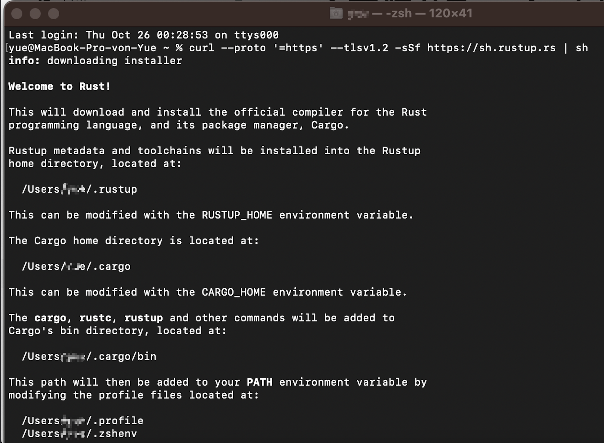
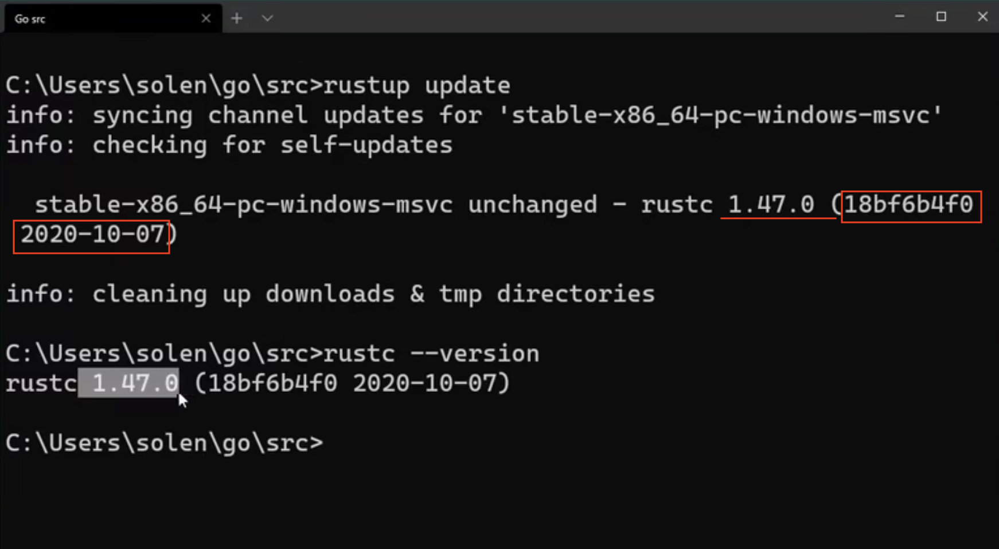

## 1. Install

When I Use Mac OS :
input the following command  `in your terminal`

```
curl --proto '=https' --tlsv1.2 -sSf https://sh.rustup.rs
```


choose 1 to continue the installation

## 2. other commands in Terminal

0. commands for install

---

> ⚠️Check whether the Rust Environment is installed correctly. The following shows the information from rust on your computer containing the version of rust
>
> Prüfen Sie, ob das Rust Environment richtig installiert wird. Folgend zeigt die Informantion von rust auf deine Computer enthalrend Version des rustes

##### 1. rustup update


**the information of this picture:rustc+[the_version]+(commit hash+yyyy-mm-dd) **

##### 2. rustc --version

```bash
rustc --version #for windows!!!
```

##### 3. rustup self uninstall

```bash
rustup self uninstall
```

##### 4. rustc doc

```
rustc doc
```

view the lolal rust instruction document

