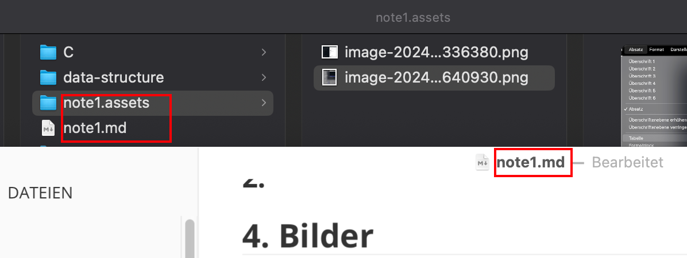
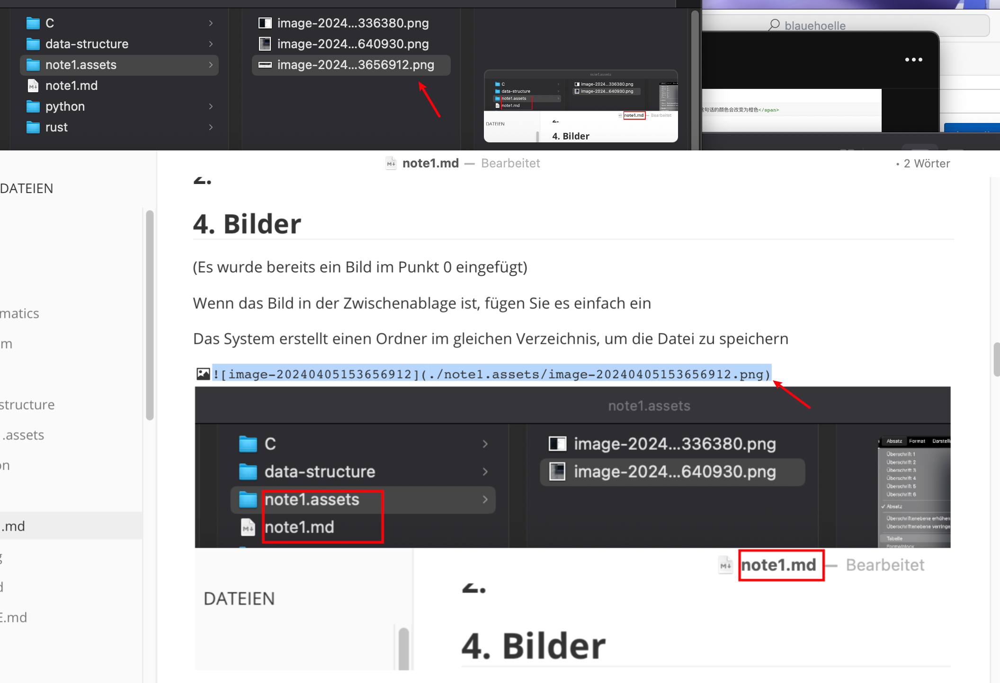

# Markdown-Syntax

⬆️Der erste Titel ist ein Titel der ersten Ebene

## Zweite Ebene

### Dritte Ebene

#### Vierte Ebene

##### Fünfte Ebene

###### Sechste Ebene

####### Höchstens sechs Ebenen für Titel

# 0. Versuch

###### ⬆️Erste Ebene

Wenn oben ein `Titel` vorhanden ist, wird er nicht angezeigt, wenn er am Anfang steht.(Auf Chinesisch-Version) ⬇️

 (Anweisungen zum Einfügen von Bildern finden Sie [im Punkt 4](#_4-Bilder))

Der obige Code lautet:

```markdown
# Titel
⬆️Der erste Titel ist ein Titel der ersten Ebene
## Zweite Ebene
### Dritte Ebene
#### Vierte Ebene
##### Fünfte Ebene
###### Sechste Ebene
####### Höchstens sechs Ebenen für Titel
# Versuch
```

(Hinweis: Der folgende Inhalt ist zuerst der Code und dann die Demonstration.)


## 1. (Kein Titel) Trennlinie

```markdown
---
```

---

## 2. Ungeordnete Titel

```
-
```

- 

### Zweite ungeordnete Titel

```
-
```

Dann einrücken mit der `Tab`-Taste

-  
    -  Zweite Ebene ungeordnet
        - Dritte Ebene ungeordnet

## 3. Geordnete Titel

Beliebiger (#)-Titel / oder Text+

```markdown
1. 
2.
```

1.  
2.  


Geordnete Titel in den Ebenen

### 1.

### 2.

## 4. Bilder

(Ein Bild wurde bereits ein Bild im [Punkt 0](#__⬆️Erste Ebene) eingefügt)

Wenn das Bild in der Zwischenablage ist, fügen Sie es einfach ein

Das System erstellt einen Ordner im gleichen Verzeichnis, um die Datei zu speichern





(Bitte spiele keinen russischen Matrjoschkas!!!)


## 5. Tabelle

###### Methode Eins

Navigieren Sie zu `Absatz` >> `Tabelle einfügen`


Geben Sie die Zeilen und Spalten der Tabelle ein (im Folgenden eine 2 x 2-Tabelle)

|      |      |
| ---- | ---- |
|      |      |

###### Methode Zwei

```|||
|Titel|Name|
```

| Titel | Name |
| ----- | ---- |
|       |      |

## 6. Links🔗

```
[Name](Webadresse)
```

```
[Name](Webadresse)
```

## 7. Formeln

Geben Sie den folgenden Code ein, um in den Formelmodus zu gelangen, normalerweise **<u>Latex</u>**-Formeln

```
$$


```

$$

## 8. Schriftart

### 8.1. Strg-bezogen

##### Einschließlich `*`-Klasse

###### Fett, kursiv

##### [`<>` und `</>` bilden eine Klasse](#__auch`<>`und `</>`bilden eine Klasse von Code)

Unterstrich

```
**Fette Schrift**
```

Oder verwenden Sie `Strg` + `b`

```markdown
*Kursiv*
Strg + i 
***Fett kursiv***
```

`Strg` +` i` dann `Strg` +`b` (keine bestimmte Reihenfolge)

```
<u>Unterstrich</u>
```

`Strg` +` u` dann `Strg` +`b`

**Fette Schrift**

*Kursiv*

***Fett kursiv***

<u>Unterstrich</u>

### 8.2. die Schriftfarbe

Die Änderung der Schriftfarbe erfolgt ebenfalls über

##### [auch `<>` und `</>` bilden eine Klasse von Code](#__`<>`und `</>`bilden eine Klasse von Code)

```markdown
<span style="color: orange">Dieser Satz wird orange gefärbt</span>
```

**<span style="color: orange">Dieser Satz wird orange gefärbt</span>**

---

Ändern Sie in eine weniger gebräuchliche Farbe

```html
<span style="color: grey">Dieser Satz wird grau gefärbt</span>
<span style="color: #808080">Nach dem Code ist dies die gleiche Graufärbung wie oben</span>


<span style="color: #ABABAB">Dieser Satz wird in einer weniger üblichen Graufarbe gefärbt</span>
<span style="color: #BFBFBF">Dieser Satz wird in einer anderen weniger üblichen Graufarbe gefärbt</span>
```

<span style="color: grey">Dieser Satz wird grau gefärbt</span>

<span style="color: #808080">Nach dem Code ist dies die gleiche Graufärbung wie oben</span>

<span style="color: #ABABAB">Dieser Satz wird in einer weniger üblichen Graufarbe gefärbt</span>

<span style="color: #BFBFBF">Dieser Satz wird in einer anderen weniger üblichen Graufarbe gefärbt</span>

### 8.3. Andere Texteffekte

### Box

```markdown
`Text, den Sie in die Box einfügen möchten`
```

`Text, den Sie in die Box einfügen möchten`

### Senkrechter Strich

```markdown
> 
```

> 

### Check-Box

```markdown
- [ ]
```

Drücken Sie `Leertaste`, um diesen Effekt zu erzielen

- [ ] 

Wenn Sie `Enter`(`return`) drücken, sieht es so aus:

- [ ]
- 

##  9. Wie kann man den Texteffekt vor dem Rendern anzeigen

```markdown
Strg + /
```

## 10. Einige Effekte `mit Plugins`

```python

```

Einige Effekte erfordern die Installation von Plugins, um sie zu realisieren. Bitte sehen Sie sich die Installations- und Verwendungshinweise unter dem obigen Link an

zum Beispiel

~~~markdown
::: details xxxx

:::
::: info xxxx

:::
:::code-tabs
@tab xxxx
```python

@tab xxxx
```python

:::
~~~