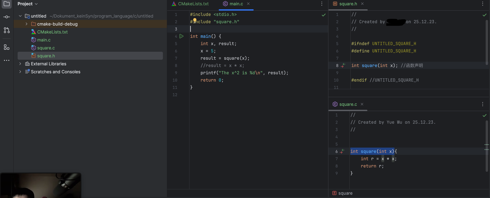

为避免不必要的修改，可以将部分代码独立成一个区块，这个区块可以以代码中的`函数`的形式表示

<span style="color: grey">~~简而言之就是建立一个（DLC)~~</span>


# 什么是函数

函数是 C 编程的核心，用于完成一系列子任务的程序解决方案。 
至此，你已经知道每个 C 程序都包含一个`main()`函数，并且已熟悉 `printf()`函数。
你也可以创建自己的函数。

```c
int funktion_name(____x  /*声明变量（录入值）____为变量类型*/){
    ____y
    
    return y; //返回值
}
```

注：main函数因为直接被调用，所以不能随意规定录入值

## 函数的特点：

- 是执行特定任务的代码块；
- 可以重复使用；
- 使程序易于测试；
- 可以在不更改`调用程序`的情况下进行修改；

将 main() 分解为子任务，即使是简单的程序也更易于理解用功能实现的。

## 「例」下面程序计算一个数字的平方：

### 例1. int **(){}

```c
#include <stdio.h>

int square(int x); //先声明函数---//
                                //
int main() {                    //
    int x, result;              //
    x = 5;                      //
    result = square(x);         //
    //result = x * x;__________ //
    printf("The x^2 is %d\n", result);
    return 0;
}


int square(int x){
    int r = x * x;
    return r;
}
```

或者（不推荐）：
0.

```c
#include <stdio.h>

int square(int x){
    int r = x * x;
    return r;
}; 

int main() {                   
    int x, result;              
    x = 5;                    
    result = square(x);         
    //result = x * x;
    printf("The x^2 is %d\n", result);
    return 0;
}
```


> 技巧
> 声明的函数代码行数过多，会影响代码可读性，不方便测试

### 2.多个程序文件：



#### *.c （储存非main函数的其他函数）

#### *.h （头文件）

在 C 语言中，`#endif` 是预处理指令的一部分，用于结束由 `#if`, `#ifdef`, 或 `#ifndef` 开始的条件编译部分。
在示例中，`#ifndef` 和 `#endif` 一起使用，形成了所谓的“包含卫士”（include guard）。包含卫士的作用是防止同一个头文件被多次包含（即重复包含）。

如何工作：

#####  `**#ifndef SQUARE_H**`：

- 这行代码检查是否已经定义了名为 `SQUARE_H` 的宏。如果没有定义（即 "if not defined"），则编译器会继续编译 `#ifndef` 和相应的 `#endif` 之间的代码。 

#####  `**#define SQUARE_H**`：

- 这行代码定义了一个名为 `SQUARE_H` 的宏。在后续的编译过程中，如果再次遇到对同一头文件的包含，`#ifndef SQUARE_H` 将评估为假，因为 `SQUARE_H` 已经定义了。 

#####  `**#endif**`：

- 这标记了条件编译部分的结束。 

通过这种方式，即使头文件在同一编译单元中被多次包含（例如，通过不同的源文件或其他头文件间接包含），它的内容也只会被实际包含一次。这样可以防止重复定义和其他潜在的编译错误。

## 声明函数

声明通常出现在main()函数上方，形式如下：

```c
return_type function_name(parameters);
```

**return_type** : "`_____`y" 函数的返回值类型；
**funktion_name**：函数名，后面有圆括号`()`；
**parameters**："`_____x`"带有声明类型的可选参数，放在括号内`()`;

> ⚠️注意
> 当函数不需要返回值时，但在声明中仍然必须有一个返回类型。这种情况下，使用关键字`void`。
> 例如display_massege函数没有返回值：

```c
void display_message();
```

C 程序必须至少具有一个 main() 的函数?

- [ ] A. 错误
- [x] B. 正确

### 函数原型

当声明中包含参数类型和名称时，该声明称为函数原型。
例如，square 函数原型出现在 main() 上面：

```c
#include <stdio.h>

/* 声明 */
int square (int num);

int main() {
    int x, result;
    
    x = 5;
    result = square(x);
    printf("%d squared is %d\n", x, result);
    
    return 0;
}
```

> 这里 square 函数**返回**一个整数，并**接收**一个 int 类型的参数。

### 定义功能

最后一步实际上是定义功能。
函数的定义通常出现在 main() 函数之后。

下面的完整程序显示了 square 函数的声明和定义:

```c
#include <stdio.h>

/* 函数声明 */
int square (int num);

int main() {
    int x, result;
  
    x = 5;
    result = square(x);
    printf("%d squared is %d\n", x, result);
    
    return 0;
}

/* 函数定义 */
int square (int num) {
    int y;

    y = num * num;

    return(y);
}
```

:::tips
正如你所见，square 函数**计算并返回**其参数的平方。
:::

一个函数可以接受多个参数--在这种情况下，它们必须用逗号 , 分隔。
return 语句将一个值返回给调用方。

填空，声明一个`triple`的函数，该函数带有一个`int`参数并返回其值乘以 3：

```c
int triple (___ num) {
    int y;
    y = num * 3;
    return (y);
}
```

> int


# 函数参数

## 按值传递参数

在调用函数时, 大多数情况下，主调函数和被调函数之间有数据传递关系，这就是有参数的函数形式。函数参数的作用是传递数据给函数使用，函数利用接收的数据进行具体的操作处理。
默认情况下，参数按值传递，这意味着将数据副本提供给被调用函数的参数。
实际变量未传递到函数中，因此函数内修改参数的值不会更改到外部对应变量的值。
传递给函数的参数**按位置与参数匹配**。因此，**第一个参数传递给第一个参数**，第二个参数传递给第二个参数，依此类推。

下面的程序演示了按值传递（录入）参数：
x、y传递给sum_up(当中的a、b)

```c
#include <stdio.h>

int sum_up(int x, int y);

int main() {
    int x, y, result;
    x = 3;
    y = 12;
    result = sum_up(x ,y);
    printf("%d + %d = %d", x, y, result);
    return 0;
}

int sum_up(int a, int b){
    a += b; // a ——> a_1 
    return (a);
}
```

输出结果：
:::tips
**3 + 12 = 15**
:::

> ⚠️注意
> 请注意，即使参数 x 的值在 sum_up 中被改变，main() 中参数 x 的值也没有改变，因为仅将其值(副本)传递到了参数 x 中。


填空，声明带有两个 float 参数的函数 test()：

```c
void test( ___  a, ___b);
```

>  float float

# 变量作用域 `Scope`

变量作用域（`Scope`），就是变量的有效范围，就是变量可以在哪个范围以内使用。有些变量可以在所有代码文件中使用，有些变量只能在当前的文件中使用，有些变量只能在函数内部使用，有些变量只能在 for 循环内部使用。

> 变量的作用域是由变量定义的位置决定，在不同的位置定义的变量，它的作用域是不一样的

- 在函数内声明的变量是该代码块的局部变量，不能在函数外部引用。
- 在所有函数外部声明的变量是整个程序的全局变量。
- 例如，在程序顶部用 #define 声明的常量对整个程序可见。

######  #define

###### #include <stdio.h>

## 全局变量

```
#include <stdio.h>

//全局变量
int global1 = 0;

int main() {
    //局部变量
    int local1, local2;
    local1 = 5;
    local2 = 10;
    global1 = local1 + local2;
    printf("%d\n",global1);
    return 0;
}
```

存在到_ C _语言结束

## 局部变量

当参数传递给函数时，参数作为局部变量。在退出函数后，参数和函数中的任何**局部变量**都被销毁。

> ⚠️注意
> 请谨慎使用全局变量。在使用它们之前，应先对其进行初始化，以避免意外结果。而且由于**可以在程序中的任何地方更改它们**，因此全局变量可能导致难以检测到错误(bug)。


变量作用域指的是?

- [x] A. 程序中变量的有效可见范围
- [ ] B. 程序中的变量数
- [ ] C. 声明的函数数量

# 静态变量

###### static

静态变量具有局部作用域，但在退出函数时**不会被销毁**。因此，静态变量将在程序生命周期内保留其值，并且每次重新输入该函数时都可以访问该静态变量。

> 静态变量在声明时被初始化，并且需要用前缀static修饰。

下面的程序使用了一个静态变量

```c
#include <stdio.h>

void say_hello();

int main() {
    int i;

    for(i = 0; i < 5; i++){
        say_hello();
    }
    return 0;
}

void say_hello(){
    //静态变量
    static int num_calls = 1;

    printf("Hello number %d\n", num_calls);
    num_calls++; 
}
```

:::tips
如果没有声明静态变量，则不能完成“num_calls”的累加这一部
:::

填空，声明静态整数变量 var 并将其初始化为值1：
___ int var ___ 1;

> static 
> =


