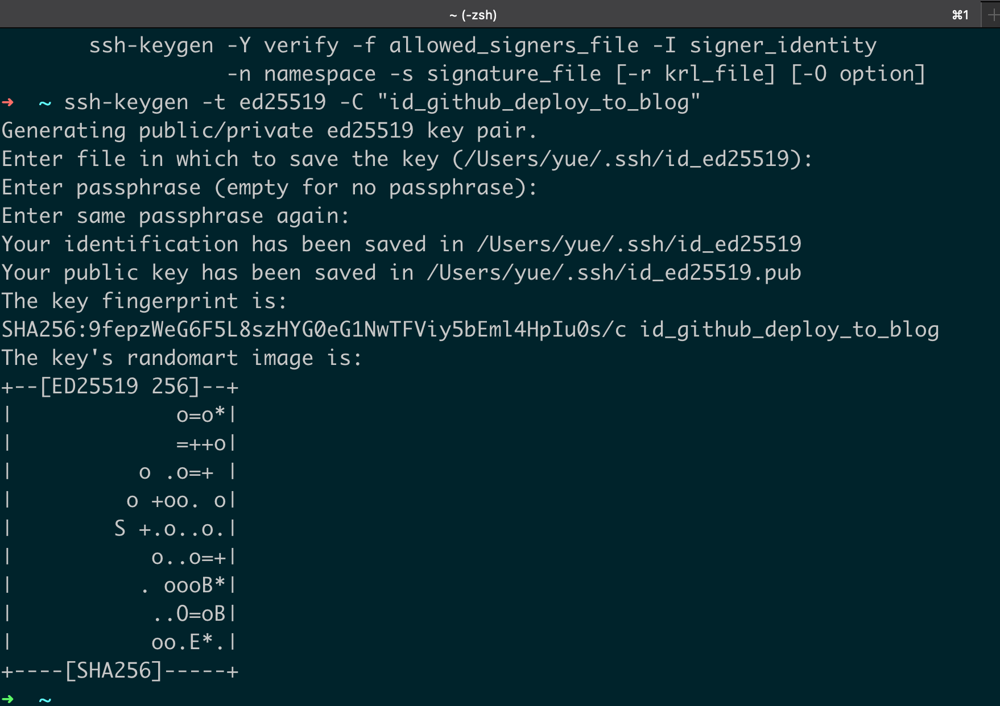

## 不同仓库的自动化部署

不想直接公开源代码，可以使用不同于网址关联的**服务器<u>仓库</u>**的**<u>私有仓库</u>**存放源代码

### 1. 生成部署用的 `SSH KEY`

输入自定义的名称，避免覆盖默认的ssh文件，影响Github的使用权。

比如 ` id_github_deploy_toblog`&`id_github_deploy_to_blog.pub`

```bash
ssh-keygen -t ed25519 -c "id_github_deploy_to_blog"
```



### 2.配置生成新的 `SSH KEY`

注：每个`private_key`只能用一次，需要生成多个ssh Key

| Key            | value |
| -------------- | ----- |
| id_ed25519.pub |       |
| id_ed25519     |       |

