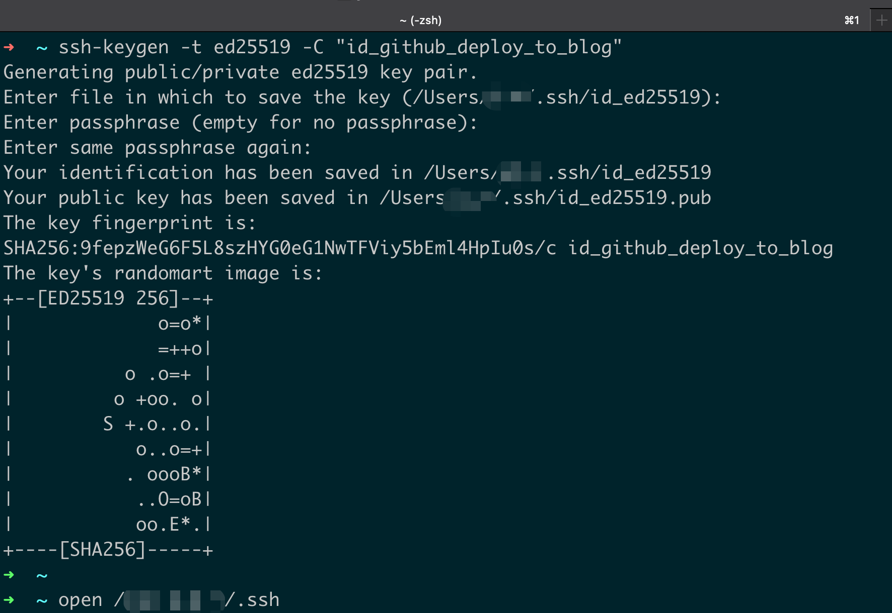
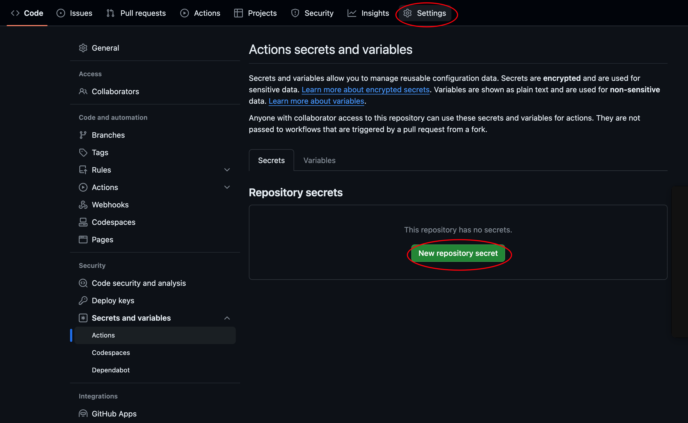
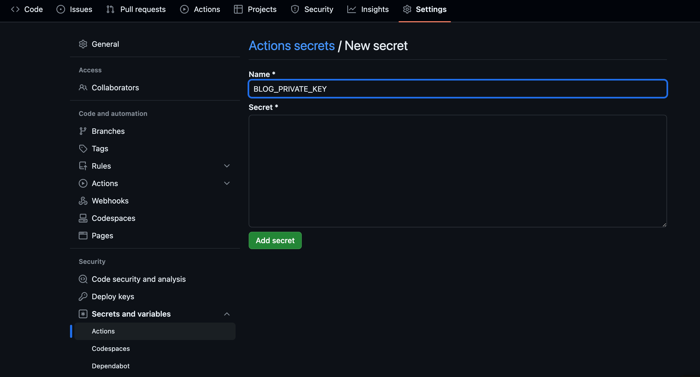
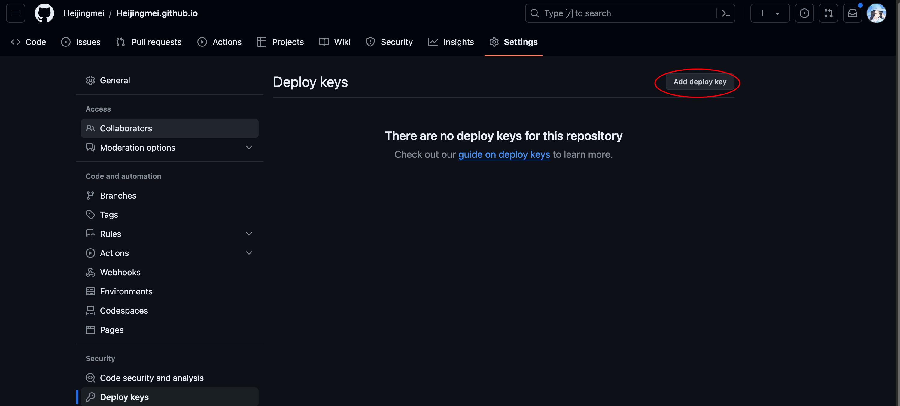
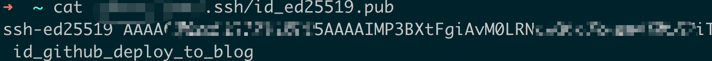
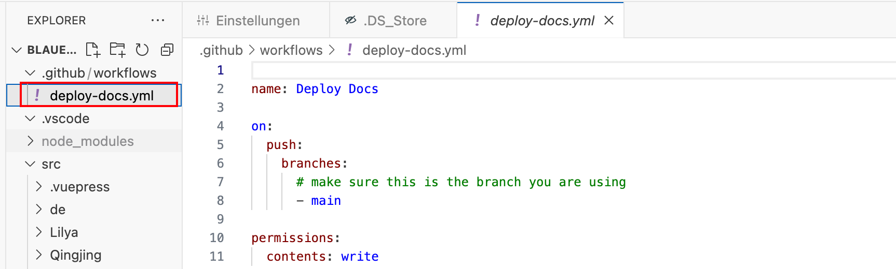

## 不同仓库的自动化部署

不想直接公开源代码，可以使用不同于网址关联的 **服务器<u>仓库</u>** 的 **<u>私有仓库</u>** 存放源代码

### 1. 生成部署用的 `SSH KEY`

输入自定义的名称，避免覆盖默认的ssh文件，影响Github的使用权。

比如 ` id_github_deploy_toblog`&`id_github_deploy_to_blog.pub`

```bash
ssh-keygen -t ed25519 -c "id_github_deploy_to_blog"
```



### 2.配置生成新的 `SSH KEY`

注：每个`private_key`只能用一次，需要生成多个ssh Key

| Key            | value           |                               |
| -------------- | --------------- | ----------------------------- |
| id_ed25519.pub | Git_Hub公开部分 | [见下](#依然使用cat抓取`KEY`) |
| id_ed25519     | Git_Hub私有仓库 |                               |

![image-20240404172850054](./note2.assets/image-20240404172850054.pngs





### 3. 在公开仓库部署KEY



#### 依然使用cat抓取`KEY`



#### 在公开仓库`KEY`处填入该内容


### 4. 对应的自动化部署脚本参考

在当前仓库和目的仓库配置好密钥

对应的 `ssh-key: ${{ secrets.BLOG_PRIVATE_KEY }}` 要和仓库中的定义匹配


```
# .github/workflows/deploy_to_blog.yml

name: Build and Deploy to gh-pages of another repository

permissions:
  contents: write

on:
# 每当 push 到 main 分支时触发部署

  push:
    branches: [main]

  jobs:
    build-and-deploy:
    concurrency: ci-${{ github.ref }}
    runs-on: ubuntu-latest
    steps:

   - name: checkout
     uses: actions/checkout@v3

   - name: node switch
     uses: actions/setup-node@v3
     with:
       node-version: '18.x'
       registry-url: 'https://registry.npmjs.org'

   - name: Install and Build
     run: |
     npm install
     npm run docs:build

   - name: Deploy
     uses: JamesIves/github-pages-deploy-action@v4
     with:
       clean: true # 默认清除，可以不配置
       branch: gh-pages # 默认分支，可不配置
       repository-name: Heijingmei/ # 提交的目的仓库
       ssh-key: ${{ secrets.BLOG_PRIVATE_KEY }} # 私钥配置在当前仓库中(settings/secrets and variables/actions/secrets),公钥配置在目的仓库中(settings/Deploy keys)
       folder: src/.vuepress/dist # 需要提交的目录文件
       clean-exclude: |
       CNAME
```


