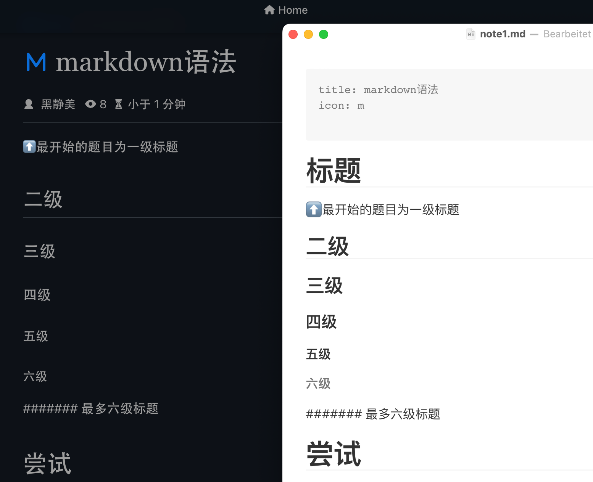
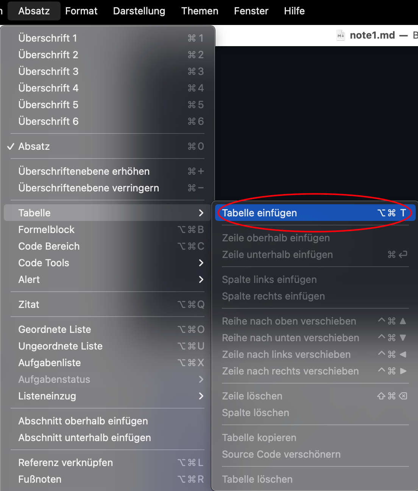

# 0. 标题

⬆️最开始的题目为一级标题

## 二级

### 三级

#### 四级

##### 五级

###### 六级

####### 最多六级标题

# 0. 尝试

⬆️一级

如果最上方有`title`一级标题放在最开始会不显示⬇️

(图片插入详见[第4点](#_4-图片))

上述代码为:

```markdown
# 标题
⬆️最开始的题目为一级标题
## 二级
### 三级
#### 四级
##### 五级
###### 六级
####### 最多六级标题
# 尝试
```

(注:后面的内容为先代码,后演示)

# 1.(非标题)分割线

```markdown
---
```

---


# 2. 无序标题

```
-
```

- 

## 二级无序标题

```
-
```

再进行`tab键`缩进

- ​	
    -  二级无序标题
        - 三级无序标题

# 3. 有序标题

任意(#)级标题/或正文内容+

```markdown
1. 
2.
```

1.  
2.  

## 1.

## 2.


# 4. 图片

(上面0有插入过图片)

当图片在粘贴板时,直接粘贴即可

系统生成一个同目录文件夹储存文件

# 5. 表格

###### 方法一

导航栏找到`段落` >> `表格`>>`插入表格`



输入表格的行列(以下为2 x 2 表格)

|      |      |
| ---- | ---- |
|      |      |

######方法二

```|||
|标题|名称|
```

| 标题 | 名称 |
| ---- | ---- |
|      |      |


# 6. 链接🔗

```
[名称](网址)
```

```
[名称](网址)
```


#  7.公式

输入以下代码进入公式模式 一般为**<u>latex</u>**公式

```
$$


```

$$

# 8. 字体

## 8.1. ctrl相关

##### 包括 `*`类

###### 加粗字体、斜体

##### `<>`和 `</>`构成的一类

###### 斜体

下划线

```
**加粗字体**
```

`ctrl`  + `b` 

```markdown
*斜体*
ctrl + i 
***加粗斜体***
```

`ctrl` +` i` 再` ctrl` +`b`(这两个没有先后顺序)

```
<u>下划线</u>
```

`ctrl` +` u` 再` ctrl` +`b`


**加粗字体**

*斜体*

***加粗斜体***

<u>下划线</u>

## 8.2. 变换字体颜色

也是

###### `<>`和 `</>`构成的一类

```python
**<span style="color: orange">这句话的颜色会改变</span>**
```

**<span style="color: orange">这句话的颜色会改变</span>**

---

变为不常见颜色


## 8.3. 其他文本效果

### 方框

```markdown
`你要放入方框中的文本`
```

`你要放入方框中的文本`

(上面已经用过了)

### 竖线

```python
> 
```

> 


#  9.如何显示渲染前的文本效果

```markdown
ctrl + /
```


# 10.部分功能需要借助插件

```python

```

部分效果需要安装插件才得以实现,请查看如上链接中的安装和使用教程

例如

~~~
::: details xxxx

:::
::: info xxxx

:::
:::code-tabs
@tab xxxx
```python

@tab xxxx
```python

:::
~~~


