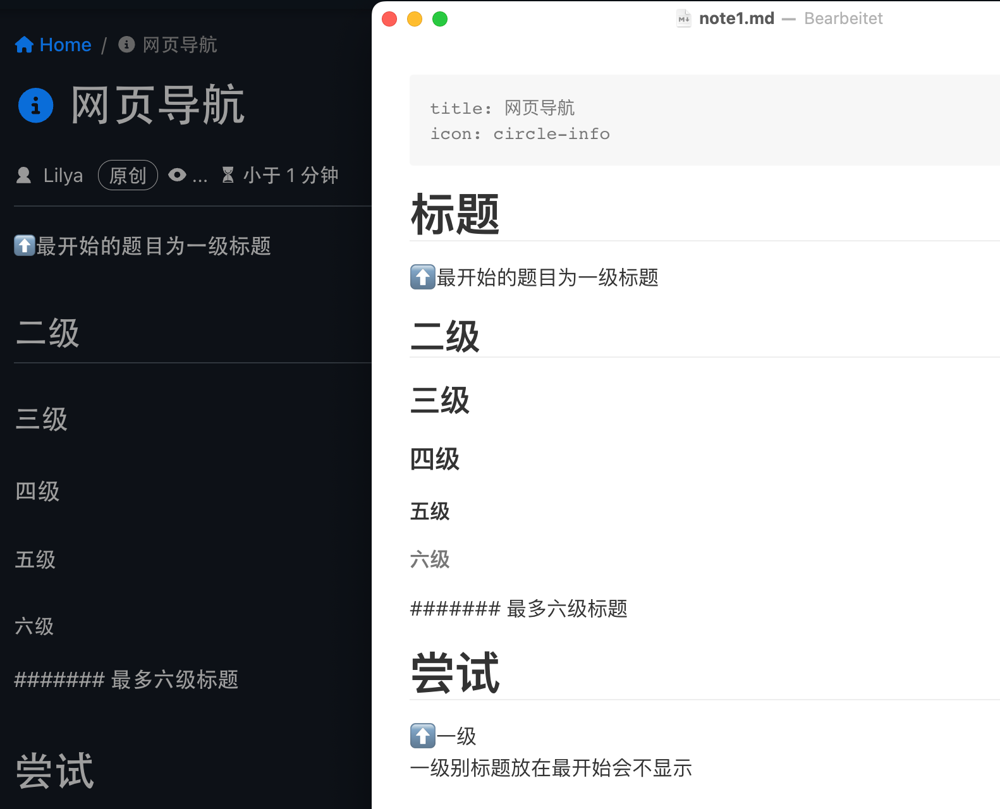

# 标题

⬆️最开始的题目为一级标题

## 二级

### 三级

#### 四级

##### 五级

###### 六级

####### 最多六级标题

# 尝试

⬆️一级<br>
一级别标题放在最开始会不显示⬇️



上述代码为：

```markdown
# 标题
⬆️最开始的题目为一级标题
## 二级
### 三级
#### 四级
##### 五级
###### 六级
####### 最多六级标题
# 尝试
```