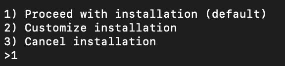

## 0. 安装

如果你暂时不想在本地安装，或者本地安装有问题，对于我们初学者来说，也有一个方便、快捷的方式，就是 Rust 语言官方提供的一个网页端的 [Rust 试验场open in new window](https://play.rust-lang.org/?version=stable&mode=debug&edition=2021)，可以让你快速体验。


这个网页 Playground 非常方便，可以用来快速验证一些代码片段，也便于将代码分享给别人。如果你的电脑本地没有安装 Rust 套件，可以临时使用这个 Playground 学习。
在`Mac OS`、 `Linux`、windows的 `WSL` 中开发：

```bash
curl --proto '=https' --tlsv1.2 -sSf https://sh.rustup.rs | sh
```


如果想在 Windows 原生平台上开发 Rust 代码，首先需要确定安装 [32 位的版本open in new window](https://github.com/AndersonHJB/BornforthisData/blob/main/column/Rust/01/rustup-init.exe)还是 [64 位的版本open in new window](https://github.com/AndersonHJB/BornforthisData/blob/main/column/Rust/01/rustup-init_64bit.exe)。在安装过程中，它会询问你是想安装 GNU 工具链的版本还是 MSVC 工具链的版本。安装 GNU 工具链版本的话，不需要额外安装其他软件包。而安装 MSVC 工具链的话，需要先安装微软的 [Visual Studioopen in new window](https://kaisery.github.io/trpl-zh-cn/ch01-01-installation.html) 依赖。


以下为`mac`安装示例


按1继续安装


##  1.其他Terminal指令

##### 安装指令

（如上） 

---

##### 1. rustup update

##### 2. rustup self uninstall

##### 3. rustc --version

##### __

```bash
rustup update

rustup self uninstall

rustc --version #适用于windows！！！
```

##### 
**信息内容 ：rustc+版本号+(yyyy-mm-dd) **

##### 4. rustc doc

```
rustc doc
```

view the lolal rust instruction document

##### 5. 新建文档（文件夹）

```bash
mkdir+（文档名+. 文档格式）#不输入文档格式即为文件夹
```

#####  6. 通过编译器进入文件夹

```bash
cd 文档名
```

 或

```bash
cd *h  #（打开上述文件 *h代表重复的名字）
```


##  2. 编辑器  IDE

开发 Rust，除了下载、安装 Rust 本身之外，还有一个工具也推荐你使用，就是 **VS Code**。需要提醒你的是，在 VS Code 中需要安装 rust-analyzer 插件才会有自动提示等功能。你可以看一下 VS Code 编辑 Rust 代码的效果。

VS Code 功能非常强大，除了基本的 IDE 功能外，还能实现**远程编辑**。比如在 Windows 下开发，代码放在 WSL Linux 里面，在 Windows Host 下使用 VS Code 远程编辑 WSL 中的代码，体验非常棒。

其他一些常用的 Rust 代码编辑器还有 VIM、NeoVIM、IDEA、Clion 等。JetBrains 最近推出了 Rust 专用的 IDE：`RustRover`，如果有精力的话，你也可以下载下来体验一下。


### 简单的创建一个`rust` 文件

#### 方法1

```bash 
. code  #windows
```

```bash
文件名 . 　#mac linux
#注意是 文件名（空格）.
```

通过Terminal通过`代码编译器`打开该文件夹


#### 新建项目

（此处缺一个图片）


#### 方法2：

##### 也可以先打开代码编译器，再由编译器创建项目

##### ！！项目最好单独建立在一个文件夹内


## 3. 创建一个工程

打开终端，输入：

```rust
cargo new --bin helloworld 
```

显示：

```rust
     Created binary (application) `helloworld` package
```

这样就创建好了一个新工程。这个新工程的目录组织结构是这样的：

```bash
helloworld
    ├── Cargo.toml
    └── src
        └── main.rss
```

第一层是一个 src 目录和一个 `Cargo.toml` 配置文件。src 是放置源代码的地方，而 `Cargo.toml` 是这个工程的配置文件，我们来看一下里面的内容。

```rust
[package]
name = "helloworld"
version = "0.1.0"
edition = "2021"

# See more keys and their definitions at https://doc.rust-lang.org/cargo/reference/manifest.html

[dependencies]
```

Cargo.toml 中包含 package 等基本信息，里面有名字、版本和采用的 Rust 版次。Rust 3 年发行一个版次，目前有 2015、2018 和 2021 版次，最新的是 2021 版次，也是我们这门课使用的版次。可以执行 `rustc -V` 来查看我们课程使用的 Rust 版本。

```rust
rustc 1.69.0 (84c898d65 2023-04-16)
```

好了，一切就绪后，我们可以来看看 src 下的 `main.rs` 里面的代码。


### 在新建的项目内打开Terminal

## 
